# Project Report: Personal Portfolio Website

This report provides a detailed breakdown of the personal portfolio website project for **Pratham Tank**. It outlines the project's layout structure, visual aesthetics, implementation technologies, code quality, and recommendations for future scalability.

---

## 1. Project Overview & Metadata

The project is a professional single-page web portfolio showcasing Pratham Tank's background, core competencies, coding skills, and completed web applications. It serves as a visual resume and direct contact point for prospective clients and employers.

| Parameter | Details |
| :--- | :--- |
| **Developer** | Pratham Tank |
| **Role / Focus** | Web Developer & Designer (3rd Year IT Student) |
| **Tech Stack** | Semantic HTML5, Vanilla CSS3 (Custom Variables), JavaScript (ES6) |
| **Deployment Platforms** | Vercel (Individual projects linked dynamically) |
| **Primary Fonts** | Poppins (Google Fonts) |
| **Primary Color Scheme** | Slate Blue & Off-White Light Theme |

---

## 2. Project Architecture & Directory Structure

The codebase is highly optimized, using a clean, minimalist structure with zero bloated frameworks:

```text
Portfolio/
├── .git/                  # Version control repository
├── .gitignore             # Git ignore rules for node modules / system files
├── index.html             # Main semantic entry point and markup script
├── style.css              # Custom styling sheet (flexbox, grid, design tokens)
└── pratham.jpeg           # High-resolution profile picture
```

### Page Structure & Navigation Flow

The single-page application is divided into six logical blocks connected by smooth-scrolling anchors and dynamic active-state styling:

```mermaid
graph TD
    A[index.html Page Loader] --> B[Header & Navigation]
    A --> C[Hero Section]
    A --> D[About Me]
    A --> E[Skills]
    A --> F[Projects]
    A --> G[Contact Me]
    A --> H[Footer]

    B --> B1[Desktop: Flat Nav Menu]
    B --> B2[Mobile: Hamburger Off-Canvas menu]
    
    C --> C1[Intro Text & Call-To-Actions]
    C --> C2[Floating Profile Card]

    D --> D1[Frontend & Backend Highlights]
    D --> D2[Bio & Work Philosophy]

    E --> E1[Coding Languages Tags]
    E --> E2[Technical & Creative Skills Tags]

    F --> F1[Landing Page Vercel Link]
    F --> F2[AI Chatbot Vercel Link]
    F --> F3[Portfolio Vercel Link]

    G --> G1[Contact Methods & Social Icons]
    G --> G2[Interactive Feedback Form]

    %% JS connection
    JS[JavaScript Engine] -.->|Toggles Off-Canvas Menu| B2
    JS -.->|Validates and Submits Form| G2
    JS -.->|Tracks Viewport & Highlights Link| B1
```



---

## 3. Detailed Component Breakdown

### A. Header & Sticky Navigation
- **HTML Element**: `<header class="header" id="header">`
- **Behavior**: Uses CSS `position: fixed` with a high `z-index: 100` to remain sticky at the top during scrolling. A subtle box shadow (`rgba(0, 0, 0, 0.05)`) separates it from page content.
- **Mobile Menu**: Responsive hamburger button (`.menu-btn`) built with CSS-animated `span` elements that transform into an "X" close icon when clicked.

### B. Hero & Profiles Section
- **HTML Element**: `<section class="hero" id="home">`
- **Layout**: Employs CSS Flexbox (`justify-content: space-between`). The left column handles text introductions and Call-to-Actions (Hire Me / Skills).
- **Profile Card**: The right column features a neat card component (`.profile-card`) that displays the profile image `pratham.jpeg` in a circular border (`border-radius: 50%`) with an "Open for Projects" status pill.

### C. About Me & Specialization Cards
- **HTML Element**: `<section class="section" id="about">`
- **Highlights**: Features two cards showing "Frontend Development" and "Backend Development" expertise using clean vector-styled inline SVGs.
- **Bio Paragraph**: Outlines student credentials (3rd Year IT student) and coding philosophies (clean, readable, and responsive codes).

### D. Skill Tag System
- **HTML Element**: `<section class="section skills" id="skills">`
- **Grouping**: Divided into *Coding Languages* and *Technical & Creative* skills.
- **Micro-interactions**: Interactive hover elements (`.skill-tag:hover`) that slide upward by `-2.5px`, change background to the primary royal blue, and cast a soft glow shadow.

### E. Projects Grid
- **HTML Element**: `<section class="section projects" id="projects">`
- **Layout**: Responsive Grid system (`grid-template-columns: repeat(auto-fit, minmax(300px, 1fr))`) that scales seamlessly across screens.
- **Interactive Cards**:
  - Inactive state: Displays clean SVG icons inside a soft blue gradient background.
  - Hover state: The icon scale increases (`scale(1.15) rotate(5deg)`) and the header shifts to deep royal blue.
- **Projects Highlighted**:
  1. **Landing Page**: Built with HTML5/CSS3. [Live Vercel Site](https://landing-page-projecr.vercel.app/)
  2. **AI Chatbot**: Built with JavaScript and external API. [Live Vercel Site](https://chatbot-pratham.vercel.app/)
  3. **My Portfolio**: The current personal website. [Live Vercel Site](https://portfolio-pratham-tank.vercel.app/)

### F. Contact Form & Methods
- **HTML Element**: `<section class="section" id="contact">`
- **Contact Details**: Provides email address (`prathamntank@gmail.com`), phone number (`+91 9408044341`), and clickable GitHub and LinkedIn social buttons.
- **Validation Form**: Contains a stylized multi-field contact form with customized inputs (`.form-control`). Field validation triggers native HTML validations (`required` attribute and `type="email"` matches).

---

## 4. Technical Analysis & Code Quality

### Design System & Theme
The CSS stylesheet uses CSS custom properties (`:root`) for consistent color theory across elements:
```css
:root {
  --primary-color: #0056b3;       /* Royal Blue */
  --primary-hover: #004085;       /* Darker Blue */
  --text-dark: #2c3e50;           /* Deep Slate Gray */
  --text-light: #6c757d;          /* Cool Gray */
  --bg-light: #f8f9fa;            /* Soft Off-White */
  --bg-white: #ffffff;            /* Pure White */
  --border-color: #dee2e6;        /* Light Gray Border */
}
```
* **Typography**: Imported font family `Poppins` via Google Fonts.
* **Layout Systems**: Standardized container class (`max-width: 1100px`, centered margins).

### JavaScript Engine Behavior
1. **Hamburger Menu Toggle**: Add/removes `.active` utility classes on click, prompting the off-canvas navigation drawer to slide in from the right edge (`right: 0` vs `right: -100%`).
2. **Dynamic Navigation Highlighting**: Listens to viewport scroll coordinates. It checks section coordinates (`section.offsetTop - 150`) against `window.scrollY` and appends the `.active` class to the active nav link in real time.
3. **Form Simulation**: Overrides standard submission default (`event.preventDefault()`). It changes the submit button text to "Sending..." and disables interactions to mimic network latency. An alert is shown to confirm completion.

### Responsive Breakpoints
The UI layout modifies elements adaptively using key breakpoints:
- **`992px`**: Switches flex layouts to vertical stacks (`flex-direction: column`) on About and Contact wrappers.
- **`768px`**: Switches standard navigation into a mobile slide-out drawer, toggling display parameters.
- **`480px`**: Resizes hero typography and converts button links into full-width tap targets.

---

## 5. SEO & Performance Check

> [!NOTE]
> The site implements crucial search engine optimization guidelines natively.

* **Title Tag**: `<title>Pratham Tank | Web Developer Portfolio</title>` is descriptive and keyword-rich.
* **Meta Description**: Provides a crisp, 140-character overview of specialties.
* **Meta Keywords**: Includes relevant terms for discovery optimization.
* **Semantic Markups**: Uses appropriate HTML tags such as `<header>`, `<nav>`, `<section>`, `<footer`, `<svg>`, and `<form>`.
* **Accessibility**: Contains `aria-label` tags on hamburger controls.

---

## 6. Recommendations & Next Steps

To elevate the portfolio to a premium grade, the following additions are recommended:

1. **Dark/Light Mode Theme Toggle**: Adding custom theme classes to dynamically adjust variables in CSS.
2. **Form Integration**: Replace simulated JS timeouts with an actual serverless contact form processor (e.g., [Formspree](https://formspree.io/) or [EmailJS](https://www.emailjs.com/)) to enable direct email delivery.
3. **Animations Library**: Introduce a scroll animation library like GSAP or AOS to fade components in gracefully as user scrolls down.
4. **Project Previews**: Replace static vectors/SVGs in project columns with captured screenshots or GIF demos of the apps.
